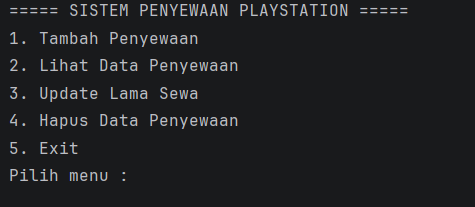
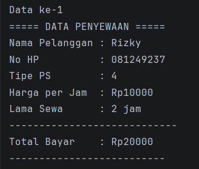
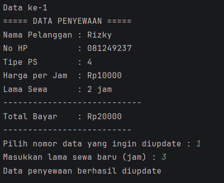
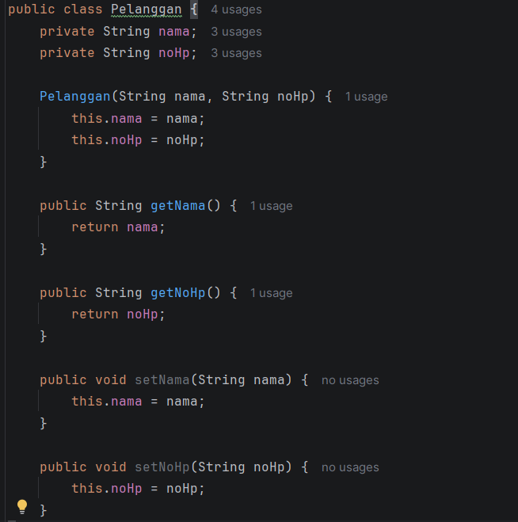
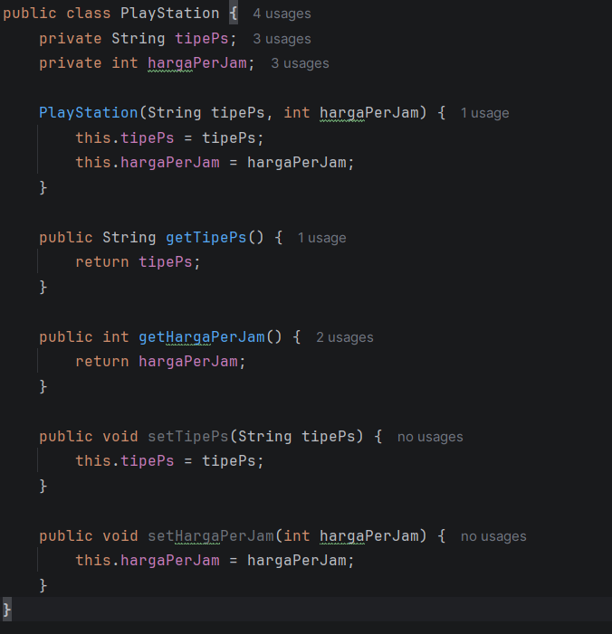
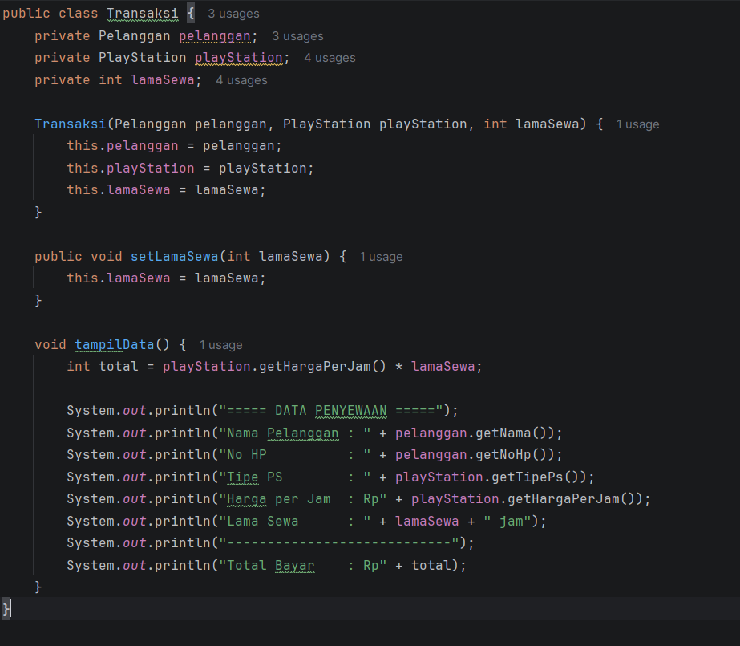

## CRUD

## Menu Program

## Create (Tambah Penyewaan)

## Read (Lihat Data Penyewaan)

## Update Lama Sewa

## Delete (Hapus Penyewaan)

## ---------------------------------------------------
## Pengguanaan Encapsulation, Getter dan Setter dan Acces Modifier

## Pelanggan 

Pada class Pelanggan, konsep Encapsulation digunakan dengan membuat atribut nama dan noHp menggunakan access modifier private sehingga tidak dapat diakses langsung dari luar class.

Data tersebut diakses menggunakan Getter yaitu getNama() dan getNoHp(), sedangkan untuk mengubah data digunakan Setter yaitu setNama() dan setNoHp().

## Playstation

Pada class PlayStation, atribut tipePs dan hargaPerJam dibuat private sebagai penerapan Encapsulation.

Untuk mengambil nilai atribut digunakan Getter yaitu getTipePs() dan getHargaPerJam().
Sedangkan untuk mengubah nilai atribut digunakan Setter yaitu setTipePs() dan setHargaPerJam().

## Transaksi

Pada class Transaksi, atribut pelanggan, playStation, dan lamaSewa dibuat private sebagai bentuk Encapsulation.

Pada class ini digunakan Setter setLamaSewa() untuk mengubah lama penyewaan.
Selain itu terdapat method tampilData() yang menggunakan Getter dari class lain seperti getNama(), getNoHp(), getTipePs(), dan getHargaPerJam() untuk menampilkan data transaksi.